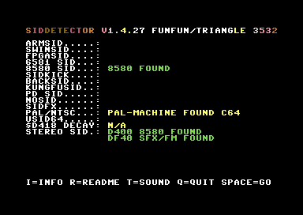

# SID Detector v1.3.84

A Commodore 64 diagnostic utility that identifies 24+ variants of the SID (Sound Interface Device) chip — including real hardware, FPGA clones, microcontroller emulators, and PC emulators.

Original release: https://csdb.dk/release/?id=176909
Author: funfun/triangle 3532
Syntax: KickAssembler (converted from ACME original)

**[STORY.md](STORY.md)** — Full technical article: detection methods, reverse-engineered protocols, SIDFX secondary probing, self-modifying code patterns, hardware testing methodology, and lessons learned. For sceners, SID musicians, and hardware developers.

---

## Screenshot



---

## What it does

When run on a C64 (or emulator), the program probes SID hardware registers, measures timing characteristics, and displays the results on screen. It detects:

| Category | Chips / Variants |
|----------|-----------------|
| Real chips | 6581 R2, R3, R4, R4AR · 8580 |
| FPGA clones | FPGASID (6581 mode · 8580 mode) |
| Microcontroller | ARMSID · ARM2SID · Swinsid Ultimate · Swinsid Nano · Swinsid Micro · SIDKick-pico · KungFuSID · BackSID · PD SID · SIDFX · ULTISID (U64) · uSID64 |
| Emulators | VICE 3.3 ResID 6581/8580 · VICE 3.3 FastSID · HOXS64 · Frodo · YACE64 · EMU64 · C64DBG |
| Machine type | C64 · C128 · TC64 (Turbo Chameleon 64) |
| Clock | PAL · NTSC |
| Stereo | Scans D400/D500/D600/D700/DE00–DFFF for additional SID chips |
| Info pages | Press **I** on the result screen for per-chip detail; CRSR LEFT/RIGHT to flip pages |

---

## Detection chain

The program runs a sequential detection pipeline at startup. Each step either identifies the chip and jumps to the result display, or falls through to the next step.

### Step 1 — SIDFX (`DETECTSIDFX`)

Communicates with the SIDFX cartridge using its SCI serial protocol over the D41E/D41F register pins. Sends a "PNP" login packet (`$80 $50 $4E $50`) and reads back a 4-byte vendor/product ID. Checks for the expected signature `$45 $4C $12 $58`.

- `data1 = $30` → SIDFX found
- `data1 = $31` → SIDFX not present

When SIDFX is found, `D41D` (SW2/SW1/PLY) and `D41E` (SID1/SID2 types) are saved. After detection, `sidfx_populate_sid_list` populates `sid_list`: slot 1 = D400 with SID1 type, slot 2 = secondary address (D420/D500/DE00 per SW1 bits 5:4) with SID2 type. Before writing the secondary type, `sfx_probe_skpico` probes the secondary for SIDKick Pico identity: enters config mode by writing `$FF` to `secondary+$1F`, then reads `VERSION_STR[0]='S'` and `[1]='K'` at `secondary+$1D` — if confirmed, the slot type becomes `$0B`/`$0E` (SIDKick Pico 8580/6581) instead of the generic 6581/8580 from SIDFX D41E.

### Step 2 — ARMSID / ARM2SID / Swinsid Ultimate (`Checkarmsid`)

Writes the ASCII string `"DIS"` to voice-3 registers (D41D/D41E/D41F), waits, then reads back D41B/D41C/D41D. Real SID chips do not echo writes; clone chips do:

| Echo in D41B | Meaning |
|-------------|---------|
| `'S'` = $53 | Swinsid Ultimate |
| `'N'` = $4E | ARMSID family |

For ARMSID, D41C and D41D further discriminate:

- D41C = `'O'` ($4F) and D41D = `'R'` ($53) → **ARM2SID**
- D41C = `'O'` ($4F) and D41D ≠ `'R'` → **ARMSID**

> **Self-modifying code:** `Checkarmsid` patches the high-byte of all its SID register addresses at runtime (e.g. `cas_d418+2`, `cas_d41D+2`) so the same routine works for both D400 and D500 (stereo second-SID scan). This is the most complex routine in the codebase.

### Steps 3a–3c — PD SID / BackSID / SIDKick-pico

These three checks run in sequence after ARMSID. All use D41D–D41F register probe protocols.

**PD SID (`checkpdsid`):** Writes `'P'` to D41D, `'D'` to D41E, reads D41E back — expects `'S'`. `data1 = $09`.

**BackSID (`checkbacksid`):** Writes `$42` to D41C, `$B5` to D41D, `$1D` to D41E, reads D41F — expects `$42` echoed. `data1 = $0A`.

**SIDKick-pico (`checkskpico`):** Enters config mode by writing `$FF` to D41F. The VERSION_STR pointer is **manual** — write `$E0+i` to D41E to select byte `i`, then read D41D. No auto-increment on reads.

| D41E write | D41D read | Meaning |
|-----------|-----------|---------|
| `$E0` | `$53` = 'S' | byte[0] of VERSION_STR |
| `$E1` | `$4B` = 'K' | byte[1] of VERSION_STR |

If both match → **SIDKick-pico** (`data1 = $0B`). Confirmed against firmware v0.22 DAC64. Full VERSION_STR: `SK\x10\x09\x03\x0F0.22/DAC64`.

### Step 3d — FPGASID (`checkfpgasid`)

Enters FPGASID configuration mode by writing the magic cookie `$81`/`$65` to D419/D41A, then sets bit 7 of D41E. Reads D419 and D41A back and checks for the identify signature `$1D`/`$F5`. If matched:

- D41F = `$3F` → **FPGASID 8580 mode** (`data1 = $06`)
- D41F = `$00` → **FPGASID 6581 mode** (`data1 = $07`)

### Step 4e — Real SID (`checkrealsid`, normal position)

Uses the voice-3 oscillator readback technique (reference: [1541 Ultimate detection code](https://github.com/GideonZ/1541ultimate/blob/master/software/6502/sidcrt/player/advanced/detection.asm)):

1. Writes `$48` (gate bit set) to D412 (voice 3 control)
2. Shifts right and writes the sawtooth waveform value to D412
3. Reads D41B (oscillator 3 output) — real SIDs echo predictable values; emulators/empty sockets do not

Then reads D41B a second time and checks for `$03`. From that value, MODE6581/MODE8580 look-up tables classify the exact sub-revision.

### Step 5 — Second SID scan (`checksecondsid`)

Uses the noise-waveform mirror test: activates noise waveform on voice 3, then reads D41B at `$D400 + $20` offsets. A real SID at that address produces non-zero random values; a mirrored (non-SID) address always reads zero.

Scans: D400, D420, D440 … DE00, DE20, DEE0, DF00 … DFE0

### Step 3e — uSID64 (`checkusid64`)

Runs after FPGASID, before the real SID check. Writes the config unlock sequence `$F0 $10 $63 $00 $FF` to D41F, then reads D41F **twice** with a ~3 ms gap.

- Both reads must be in `$E0–$FC` range (not `$FF`)
- Both reads must agree within `$02` of each other (stable — the chip holds the value)

A decaying NOSID bus typically reads `$FF` (the last written value), or if it has drifted into `$E0–$FE`, the two reads will differ by more than `$02`. Either condition rejects the chip.

- `data1 = $0D` → uSID64

### Step 0.25 — Real SID pre-check (`checkrealsid`, early)

Runs **before** SwinSID Nano to prevent false positives on real 6581/8580. Uses the voice-3 oscillator readback (see Step 4e). `checkrealsid` only writes to D412/D40F — never D41F — so it is safe to run early. If a real SID is confirmed here, `checkswinsidnano` is skipped entirely.

### Step 5c — SwinSID Nano (`checkswinsidnano`)

Runs at Step 0.5 (before SIDFX), provided no real SID was found at Step 0.25. Uses D41B (OSC3) activity counting with noise waveform at maximum frequency (`$FFFF`):

**Stage 1 — Change-count gate:** Reads D41B 8 times back-to-back and counts how many consecutive pairs differ. A real 6581/8580 LFSR advances every CPU clock at `$FFFF` frequency — all 7 pairs always change (cnt = 7). The SwinSID Nano AVR updates at ~44 kHz (much slower than the 985 kHz C64 clock), so some reads catch the same LFSR value (cnt = 3–7, hits 7 in ~40% of windows). Stage 1 retries up to 3 times and only rejects if **all** attempts give cnt = 7 (guaranteed real-SID speed). P(all 3 fail for SwinSID Nano) ≈ 6%.

**Stage 2 — Activity confirmation at 62 ms:** After a 50 ms wait, counts changes in another 8-read window. Requires cnt ≥ 3. Filters out a fully-dead NOSID bus that happens to have passed Stage 1.

> **Known limitation:** A C64 with an Ultimate II+ cartridge and virtual SID disabled generates FPGA-sourced bus noise at ~44 kHz that is indistinguishable from the SwinSID Nano oscillator. Such a setup will be reported as SwinSID Nano rather than NOSID.

- `data1 = $08` → SwinSID Nano (or NOSID + U2+ with virtual SID off)

### Step 5b — KungFuSID (`checkkungfusid`)

Runs after all other hardware checks have failed (last chance before SwinSID Nano / NOSID). Writes `$A5` (firmware-update magic) to D41D, waits ~6 ms, reads D41D back.

| Read back | Meaning |
|-----------|---------|
| `$5A` | New firmware: ARM acknowledged the update-start magic → **KungFuSID** |
| `$A5` | Old firmware: register echoes the last write (all SID registers are stored in RAM array) → **KungFuSID** |
| anything else | Not KungFuSID |

Old firmware reason: `kff_read_handler` returns `SID[register_addr]` for every address except the firmware-update register on new firmware. Writing `$A5` stores it; reading back returns `$A5`. Real SID chips, ARMSID, FPGASID, and SIDKick all produce different values.

- `data1 = $0C` → KungFuSID

### Step 6 — $D418 decay fingerprint (`calcandloop` + `ArithmeticMean`)

Sets the volume register D418 = `$1F` then counts CPU cycles until it decays to zero. Different emulators decay at different rates. The routine:

1. Samples 6 times (controlled by `NumberInts = $06`)
2. Averages the samples with `ArithmeticMean` (16-bit accumulator, integer division)
3. Compares the average against a `MODE6581`/`MODE8580`/`MODEUNKN` table to print the emulator name

This fingerprint distinguishes VICE ResID, VICE FastSID, HOXS64, Frodo, YACE64, and EMU64.

---

## Machine type detection

### PAL / NTSC (`checkpalntsc`)

Patches the NMI vector to RTI, then checks whether a raster IRQ fires at line `$137` (which only exists on PAL machines with 312 lines). Result stored in KERNAL variable `$02A6`:

- `1` = PAL (~50 Hz)
- `0` = NTSC (~60 Hz)

All timing loops in the detection chain are calibrated to this value.

### C64 / C128 / TC64 (`check128`)

1. Reads `$D030` (C128 speed register; returns `$FF` on open C64 bus → C64 identified)
2. If not `$FF`, writes `$2A` to `$D0FE` and reads it back:
   - Returns `$FC` → **Commodore 128**
   - Returns other → **Turbo Chameleon 64** (TC64)

Result stored in `za7` (`$A7`).

---

## Memory layout

| Address | Contents |
|---------|----------|
| `$0801` | BASIC stub: `SYS 2061` |
| `$080D` | Main program, all subroutines |
| `$1E00` | Detection result tables: `num_sids`, `sid_list_l/h/t`, `sid_map` |
| `$1E25+` | Screen data, info page text, string labels, colour table |

### Zero-page variables

| Address | Name | Purpose |
|---------|------|---------|
| `$A4` | `data1` | Primary result (chip type code) |
| `$A5` | `data2` | Secondary result (echo char / sub-type) |
| `$A6` | `data3` | Tertiary result (ARM2SID `'R'` discriminator) |
| `$A7` | `za7` | Machine type: `$FF`=C64, `$FC`=C128, other=TC64 |
| `$F7` | `sidnum_zp` | Number of SID chips found |
| `$F9–$FA` | `sptr_zp` | SID base address pointer (e.g. `$D4:$00`) |
| `$FC–$FD` | `mptr_zp` | Mirror-scan address pointer |

---

## Result codes (`data1`)

| Code | Chip |
|------|------|
| `$01` | 6581 |
| `$02` | 8580 |
| `$04` | Swinsid Ultimate |
| `$05` | ARMSID / ARM2SID |
| `$06` | FPGASID 8580 |
| `$07` | FPGASID 6581 |
| `$08` | Swinsid Nano |
| `$09` | PD SID |
| `$0A` | BackSID |
| `$0B` | SIDKick-pico |
| `$0C` | KungFuSID |
| `$0D` | uSID64 |
| `$10` | Second SID found |
| `$20`–`$21`/`$24`–`$26` | ULTISID 8580 |
| `$22`–`$23` | ULTISID 6581 |
| `$30` | SIDFX |
| `$31` | No SIDFX |
| `$F0` | No SID / Unknown |

---

## Screen layout (v1.3.83)

```
            siddetector v1.3.83

row  2: armsid.....:  [result]
row  3: swinsid....:  [result]
row  4: fpgasid....:  [result]
row  5: 6581 sid...:  [result]
row  6: 8580 sid...:  [result]
row  7: sidkick....:  [result]
row  8: backsid....:  [result]
row  9: kungfusid..:  [result]
row 10: pd sid.....:  [result]
row 11: nosid......:  [result]
row 12: sidfx......:  [result]
row 13: pal/ntsc...:  [PAL/NTSC]   [C64/C128/TC64]
row 14: usid64.....:  [result]
row 15: $d418 decay:  [value]
row 16: stereo sid.:  [address + chip name per slot]
```

Spacebar restarts the full detection sequence (raster-stable restart via `$D012` spin). Pressing SPACE also silences all SID voices immediately.

Press **P** to play/stop the built-in Triangle Intro SID music (50 Hz IRQ-driven, `$1800`). Press **P** again to stop.

Press **I** to enter the info page for the detected chip. Navigate with CRSR LEFT/RIGHT; SPACE returns to the main screen. 17 pages are available (one per chip type), browsable in any order.

---

## Build

```bash
make        # assemble siddetector.asm → siddetector.prg  (requires Java + KickAss.jar)
make run    # build and launch in WinVICE (x64sc)
make clean  # remove siddetector.prg
```

**Requirements:**
- Java runtime
- KickAssembler at `C:/debugger/kickasm/KickAss.jar`
- WinVICE at `C:/winvice/bin/x64sc.exe`

---

## Unit testing

Tests are written in 6502 assembly (KickAssembler syntax) and run inside WinVICE. Each test preset the relevant zero-page inputs (`data1`, `data2`, `data3`, `za7`), calls an embedded copy of the dispatch logic, compares the returned result code against the expected value, and displays `PASS` / `FAIL` on the C64 screen. The final pass count is written to `$07E8` (off-screen RAM) for inspection in the VICE monitor.

### Running tests

```bash
make test           # ArithmeticMean unit tests       (4 cases)
make test_dispatch  # ARMSID / FPGASID dispatch tests (8 cases)
make test_suite     # Full suite — all scenarios      (23 cases)
```

After VICE opens, all results are visible on screen immediately. To check the pass count in the VICE monitor (`Alt+M`):
```
mem $07E8 $07E8    # shows pass count; $17 (23) = all passed for test_suite
```

### Test files

| File | Tests | Covers |
|------|-------|--------|
| `tests/test_arith.asm` | 4 | `ArithmeticMean` — pure computation |
| `tests/test_dispatch.asm` | 8 | ARMSID / ARM2SID / FPGASID dispatch |
| `tests/test_suite.asm` | 23 | All dispatch stages (see table below) |

Each file has a matching `.mon` VICE moncommands file that loads symbols and sets a breakpoint at `td_spin` (the completion spin-loop).

### Full suite coverage (test_suite.asm)

| Section | Tests | Stage | Inputs → Expected result |
|---------|-------|-------|--------------------------|
| S1 | T01–T03 | Machine type | `za7=$FF` → C64 · `$FC` → C128 · other → TC64 |
| S2 | T04–T05 | SIDFX | `data1=$30` → found · `$31` → not found |
| S3 | T06–T10 | Swinsid/ARMSID | `$04` → Swinsid-U · `$05/$4F/$53` → ARM2SID · `$05/$4F/other` → ARMSID · no-match cases |
| S4 | T11–T13 | FPGASID | `$06` → 8580 · `$07` → 6581 · other → no match |
| S5 | T14–T16 | Real SID | `$01` → 6581 · `$02` → 8580 · other → no match |
| S6 | T17–T18 | Second SID / no sound | `$10` → second SID · other → no sound |
| S7 | T19–T22 | ArithmeticMean | `[10,20,30]`=20 · `[5×6]`=5 · `[100,50,75,25]`=62 · empty=0 |
| S8 | T23 | FPGA stereo | `data1=$06` at `$D500` → recorded in `sid_list` |

### Design approach

Because the actual detection routines (`Checkarmsid`, `checkfpgasid`, etc.) probe real SID hardware registers, they cannot be tested deterministically inside VICE — VICE's SID emulates an 8580 and returns fixed values. The tests therefore target the **dispatch logic**: the code that reads `data1`/`data2`/`data3` (already set by the detection routines) and branches to the correct chip identification. Each dispatch routine is an embedded copy of the relevant branch block from `siddetector.asm`, with `jsr $AB1E` / `jsr $E50C` / `jmp end` replaced by a result-code write to `dispatch_result`.

### Adding a test

1. Identify the zero-page inputs for the scenario
2. Add a dispatch routine that mirrors the branch logic from `siddetector.asm`
3. Write a test block: set inputs → call dispatch → compare `dispatch_result` → print PASS/FAIL
4. Increment `pass_count` on pass
5. Update the total expected count in `test_done` (`cmp #N`)

### What remains untested

| Area | Why |
|------|-----|
| `Checkarmsid` hardware probe | Writes to SID regs; VICE returns fixed 8580 values |
| `checkfpgasid` magic-cookie | Config mode only exists on real FPGASID hardware |
| `checkrealsid` OSC3 readback | Depends on real sawtooth waveform decay |
| `checksecondsid` noise mirror | Depends on real noise-waveform $D41B randomness |
| `calcandloop` decay timing | Emulator timing differs from hardware by design |

---

## Known issues / TODO

- **Fixed V1.3.84:** SIDFX secondary D420 probing: (1) removed D41D echo test — SIDFX write-buffers unmapped registers ($1D–$1F), causing any chip at D420 to echo back the written value (not chip-specific). (2) When primary SID is ARMSID, skip DIS probe at D420 entirely — ARMSID snoops CS2 DIS writes and drives $4E aggressively on all D4xx bus reads, contaminating D43B. Falls back to SIDFX-reported type (6581/8580). DIS probe still works for D420 with non-ARMSID primary, and for D5xx+ regardless of primary. Added D41B ACK in `sfx_probe_dis_echo` before secondary reads (harmless for non-ARMSID primaries).
- **Fixed V1.3.83:** Detection confidence indicator — if `checkrealsid` needed retries due to VIC bad-line DMA steals, a `*` is appended after "6581 FOUND"/"8580 FOUND" on the main screen. `retry_zp` ($B2) tracks how many of the 3 attempts were used.
- **Fixed V1.3.81:** Multi-SID sound test now plays the full 3-voice melody on every detected SID slot (not just a triangle tone). `snd_patch_page` self-modifies all 31 `sta $D4xx` instructions in `st_soundtest` to the target SID page.
- **Fixed V1.3.80:** Stereo ARMSID@D400 + SwinSID U/ARMSID@D5xx — `s_s_arm_call_real` now allows `sfx_probe_dis_echo` when primary is ARMSID (`data4=$05`); the probe reads from `candidate+$1B` so D400 ARMSID snooping the DIS writes does not corrupt the result. Requires dual ARMSID/SwinSID U hardware to verify.
- **Fixed V1.3.79:** SwinSID Ultimate fiktivloop false positive — AVR OSC3 returns 0 with noise enabled, causing `checksecondsid` to falsely detect D500 as a second SID. Fixed by skipping `fiktivloop` when primary is SwinSID U (`data4=$04`).
- **Fixed V1.3.79:** Stereo 6581@D400 + SwinSID U@D500 — `s_s_arm_call_real` now tries `sfx_probe_dis_echo` before `checkrealsid` when primary is a real SID; SwinSID U echo returns 'S' and is correctly identified.
- **Fixed V1.3.73:** 8580@D400 + ARMSID@D420 (MixSID, C09 config) now correctly detected
- **Fixed V1.3.74:** 6581@D400 + ARMSID@D420 (MixSID, C08 config) now correctly detected
- ARM2SID stereo D400+D500 not yet verified on hardware
- Stereo slots D700 and DF00 not yet tested on hardware
- Swinsid Nano with NOSID+U2+ (Ultimate II+ with virtual SID off) is indistinguishable — reported as SwinSID Nano; accepted limitation
- FPGASID in SIDFX SID1 slot is undetectable: SIDFX drives D419/D41A (POT registers) with real joystick data, masking FPGASID's identify-mode readback signature; additionally, the SIDFX SCI state machine reacts to D41E writes, disrupting the magic-cookie handshake. No software workaround is possible. Reported as SIDFX with unknown SID type.
